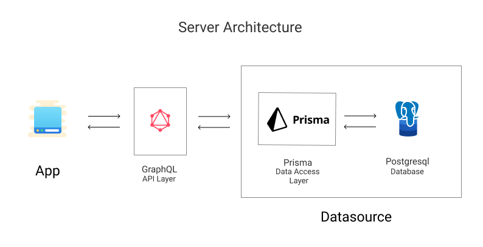

# Ocents
Ocents is a platform for facilitating communication. It will help you to inform others, plan things and discuss together. 

* Invite everyone with a shareable Link. 
* Notify your audience with updates you make. 
* Discuss stuff that matters, keeping everyone in the sync. 
* Sell tickets for your conferences, webinars, online courses. 
* Raise funds for a cause, projects or anything you can think of. 

## Some typical use cases

1. The tutors can create an event page, and just post updates for any successive online classes they host. They can clear up doubts, and answers are visible to others as well. 

2. A group of friends can create a page to jam up ideas for a project they want to work on. 

## Tech Stack 

